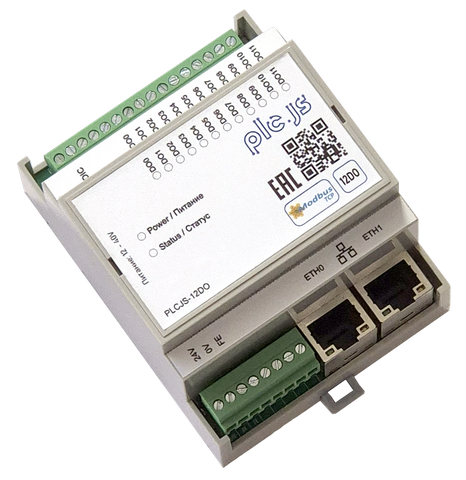

# PLCJS Ethernet модуль ввода/вывода 12DQ 24VDC

<p align="center">
  
</p>

<p align="center"><strong>Внешний вид</strong></p>

Прошивка Ethernet-модуля PLCJS с 12 дискретными выходами на базе STM32F407VGT6.
Устройство управляется по Modbus TCP, сохраняет настройки во внутренней Flash и позволяет независимо настроить поведение каждого выхода при потере связи.

## Основные возможности

- 12 дискретных выходов DQ1…DQ12;
- индивидуальное и групповое управление выходами по Modbus TCP (holding-регистры или coils FC01/FC05/FC15);
- независимые для каждого выхода режим, безопасное значение и таймаут при потере связи;
- DHCP или статическая IPv4-конфигурация;
- уникальный стабильный MAC-адрес для каждого экземпляра устройства;
- сохранение настроек и начального состояния выходов во Flash;
- аппаратный и программный возврат к заводским настройкам;
- переход в Ethernet bootloader по команде Modbus;
- индикация Ethernet-соединения и активности Modbus через STAT_LED;
- аппаратный watchdog.

## Быстрый запуск

1. Подключите питание, Ethernet и нагрузку к нужным выходам.
2. Из коробки устройство поднимается на AutoIP link-local `169.254.<mac[4]>.<mac[5]>` (/16).
3. Найдите его по MAC через discovery (вкладка «Обнаружение» в ModbusTool, UDP-broadcast порт `20556`) или подключитесь к адресу с наклейки. Адрес наклейки можно вычислить заранее: `node tools/device_id.mjs --stlink --variant 12do` (в репозитории загрузчика).
4. Подключитесь Modbus TCP-клиентом, порт `502`, Unit ID `1`; при необходимости назначьте рабочий IP через `SET_NET` или регистры `104…116`.
5. Запишите `1` в holding register `51`, чтобы включить DQ1; запишите `0`, чтобы выключить его.
6. Для постоянного сохранения текущих настроек запишите `0xA5A5` в holding register `117`.

> Все адреса в этом документе указаны в **нулевой адресации протокола Modbus**. Если программа показывает регистры как `4xxxx`/`3xxxx` с единицы, учитывайте её смещение адресации.

## Технические параметры

| Параметр | Значение |
|---|---|
| Назначение | Ethernet-модуль 12 дискретных выходов |
| MCU | STM32F407VGT6, Arm Cortex-M4F |
| Ethernet | KSZ8863, RMII, два контролируемых внешних порта |
| Протокол управления | Modbus TCP server |
| Количество одновременных клиентов | 1 |
| Дискретные выходы | 12, push-pull, active-high |
| Логика выхода | `0` = низкий уровень, `1` = высокий уровень |
| Групповая маска | 12 бит, `0x000…0xFFF` |
| Единица таймаута потери связи | 100 мс |
| Сетевой режим по умолчанию | link-local (`USE_DHCP = 2`) |
| Заводской адрес | `169.254.<mac[4]>.<mac[5]>` /16, из UID |
| Modbus TCP порт по умолчанию | 502 |
| Modbus Unit ID по умолчанию | 1 |
| Резервный static IPv4 | `192.168.1.10/24`, шлюз `192.168.1.1` |
| MAC-адрес | уникальный, локально администрируемый unicast, вычисляется из 96-битного UID MCU |
| Factory reset | кнопка FACT_RES при включении или команда Modbus |
| Индикация | STAT_LED, active-high |
| Watchdog | IWDG |
| Module ID в Modbus | `0x12D0` |
| Product ID образа | `0x504C1202` |
| HW revision образа | `0x0101` (1.1) |
| FW version образа | `0x0107` (1.7) |
| Версия в Modbus IR120/IR121 | 1.7 |

Электрические пределы клеммных выходов — допустимое напряжение, ток нагрузки, защита и схема подключения — должны определяться по схеме платы и документации на аппаратную ревизию. GPIO-уровни MCU в таблице ниже не являются допустимыми параметрами внешней нагрузки.

## Дискретные выходы

Логическая `1` устанавливает высокий уровень на соответствующем GPIO. Выходы после запуска восстанавливаются из сохранённой маски; заводское состояние всех выходов — `0`.

| Канал | Holding value | Input echo | Бит групповой маски | MCU GPIO |
|---|---:|---:|---:|---|
| DQ1 | 51 | 0 | `0x001` | PC11 |
| DQ2 | 52 | 1 | `0x002` | PC10 |
| DQ3 | 53 | 2 | `0x004` | PA9 |
| DQ4 | 54 | 3 | `0x008` | PA8 |
| DQ5 | 55 | 4 | `0x010` | PC9 |
| DQ6 | 56 | 5 | `0x020` | PC8 |
| DQ7 | 57 | 6 | `0x040` | PD10 |
| DQ8 | 58 | 7 | `0x080` | PD9 |
| DQ9 | 59 | 8 | `0x100` | PD8 |
| DQ10 | 60 | 9 | `0x200` | PE14 |
| DQ11 | 61 | 10 | `0x400` | PE13 |
| DQ12 | 62 | 11 | `0x800` | PE12 |

Holding register `50` управляет всеми каналами одной 12-битной маской. Например, `0x005` включает DQ1 и DQ3 и выключает остальные выходы.

Каждому выходу дополнительно соответствует coil с адресом из колонки «Input echo» (`0…11`): DQ1 = coil `0` … DQ12 = coil `11`. Coils можно использовать вместо holding-регистров значений (см. раздел «Coils — FC01 / FC05 / FC15»).

### Поведение при потере Modbus-связи

Потерей связи считается отсутствие успешных Modbus-запросов в течение индивидуального таймаута канала. Отсчёт до первого запроса идёт от запуска устройства.

| Код | Режим | Действие после таймаута |
|---:|---|---|
| `0` | HOLD | оставить последнее состояние; заводской режим |
| `1` | ZERO | установить выход в `0` |
| `2` | SAFE | установить индивидуальное безопасное значение `0` или `1` |

Таймаут задаётся в единицах по 100 мс. Значение `10` соответствует 1 секунде, `50` — 5 секундам. При значении `0` действие ZERO/SAFE выполняется сразу. После срабатывания состояние фиксируется до следующей явной команды этому выходу или записи групповой маски; автоматического возврата к предыдущему состоянию нет.

## Сеть

### Заводские настройки

| Параметр | Значение |
|---|---|
| Сетевой режим (`USE_DHCP`) | `2` = link-local |
| Заводской адрес | `169.254.<mac[4]>.<mac[5]>` /16 |
| Резервные static-поля | IP `192.168.1.10`, маска `255.255.255.0`, шлюз `192.168.1.1` |
| TCP-порт | `502` |
| Unit ID | `1` |

Из коробки используется link-local `169.254.x.y` (находится по MAC через discovery). Регистр `116`: `0` = static, `1` = DHCP, `2` = link-local. Для статики запишите `116 = 0` и заполните регистры `104…115`; для DHCP — `116 = 1`. Изменения применяются на лету после сохранения через регистр `117` — перезагрузка не требуется.

MAC имеет формат `02:00:HH:HH:HH:HH`, где четыре последних октета получены CRC32-хешированием уникального 96-битного UID STM32. Он стабилен для конкретного MCU и одинаков в приложении и совместимом bootloader.

### Сквозной коммутатор и политика сброса KSZ8863

Модуль работает как проходной коммутатор: трафик между внешними портами 1 и 2 KSZ8863 форвардится автономно, без участия MCU. Чтобы транзит не прерывался, прошивка минимизирует аппаратные сбросы коммутатора:

- аппаратный сброс KSZ8863 выполняется **только при подаче питания** (power-on / brown-out);
- программная перезагрузка (`TRIG_REBOOT`), заводской сброс, вход в bootloader, срабатывание watchdog и сброс по NRST **не трогают коммутатор** — транзит порт 1 ↔ порт 2 продолжается во время перезапуска MCU;
- при аварийной остановке MCU (`Error_Handler`) линия сброса коммутатора принудительно отпускается, чтобы «зависший» контроллер не остановил транзит;
- если коммутатор перестаёт отвечать по SMI дольше 5 секунд, выполняется автоматический восстановительный сброс (не чаще одного раза в 30 секунд);
- оператор может принудительно сбросить коммутатор командой `0x8863` в регистр `118` — транзит при этом прерывается на время сброса и автонегоциации портов.

## Таблица переменных Modbus TCP

Поддерживаемые функции:

| Function code | Операция |
|---:|---|
| FC01 | чтение coils (состояние выходов DQ1…DQ12) |
| FC03 | чтение holding registers |
| FC04 | чтение input registers |
| FC05 | запись одного coil (управление одним выходом) |
| FC06 | запись одного holding register |
| FC15 | запись нескольких coils (групповое управление выходами) |
| FC16 | запись нескольких holding registers |

Discrete inputs (FC02) не реализованы. Недопустимый адрес возвращает `ILLEGAL_DATA_ADDRESS`, недопустимое значение — `ILLEGAL_DATA_VALUE`.

### Coils — FC01 / FC05 / FC15

Coils `0…11` являются альтернативным интерфейсом к выходам DQ1…DQ12 и работают в нулевой адресации.

| Адрес coil | Канал | R/W |
|---:|---|:---:|
| `0…11` | DQ1…DQ12 | R/W |

- запись coil (FC05/FC15) эквивалентна записи соответствующего регистра значения `DQ_VALUE` (`51…62`): выход управляется тем же путём, поэтому логика режима и таймаута потери связи (`63…98`) применяется одинаково;
- изменение отражается в RAM сразу, но во Flash фиксируется только явной командой `TRIG_SAVE` (`117 = 0xA5A5`);
- чтение coil (FC01) возвращает фактическую маску выходов — тот же источник, что и `DQ_MASK` (IR124).

### Input registers — FC04, только чтение

| Адрес | Переменная | Тип / диапазон | Описание |
|---:|---|---|---|
| `0…11` | `DQ_STATE[1…12]` | `uint16`, `0/1` | фактическое логическое состояние DQ1…DQ12 |
| `120` | `FW_VERSION_MAJOR` | `uint16` | major-версия интерфейса Modbus, сейчас `1` |
| `121` | `FW_VERSION_MINOR` | `uint16` | minor-версия интерфейса Modbus, сейчас `7` |
| `122` | `UPTIME_LO` | `uint16` | младшее слово времени работы в секундах |
| `123` | `UPTIME_HI` | `uint16` | старшее слово времени работы в секундах |
| `124` | `DQ_MASK` | `uint16`, `0x000…0xFFF` | текущая маска всех выходов |
| `125` | `MODULE_ID` | `uint16` | `0x12D0`, идентификатор варианта 12DO |

Время работы: `uptime_seconds = (UPTIME_HI << 16) | UPTIME_LO`.

### Holding registers — FC03 / FC06 / FC16

| Адрес | Переменная | R/W | Диапазон / команда | Заводское значение | Когда применяется |
|---:|---|:---:|---|---:|---|
| `50` | `DQ_GROUP` | R/W | `0x000…0xFFF` | `0` | сразу; задаёт все 12 выходов |
| `51…62` | `DQ_VALUE[1…12]` | R/W | `0/1` | `0` | сразу |
| `63…74` | `DQ_LOSS_MODE[1…12]` | R/W | `0` HOLD, `1` ZERO, `2` SAFE | `0` | сразу |
| `75…86` | `DQ_SAFE_VALUE[1…12]` | R/W | `0/1` | `0` | сразу |
| `87…98` | `DQ_TIMEOUT[1…12]` | R/W | `0…65535`, ×100 мс | `0` | сразу |
| `99` | резерв | — | — | — | адрес не реализован |
| `100` | резерв | — | — | — | адрес не реализован |
| `101` | `LED_MODE` | R/W | `0` off, `1` on, `2` state machine | `2` | сразу |
| `102` | `SLAVE_ID` | R/W | `1…247` | `1` | для новых Modbus-сессий |
| `103` | `TCP_PORT` | R/W | `1…65535` | `502` | после сохранения и перезагрузки |
| `104` | `IP_OCTET_1` | R/W | `0…255` | `192` | после сохранения и перезагрузки |
| `105` | `IP_OCTET_2` | R/W | `0…255` | `168` | после сохранения и перезагрузки |
| `106` | `IP_OCTET_3` | R/W | `0…255` | `1` | после сохранения и перезагрузки |
| `107` | `IP_OCTET_4` | R/W | `0…255` | `10` | после сохранения и перезагрузки |
| `108` | `MASK_OCTET_1` | R/W | `0…255` | `255` | после сохранения и перезагрузки |
| `109` | `MASK_OCTET_2` | R/W | `0…255` | `255` | после сохранения и перезагрузки |
| `110` | `MASK_OCTET_3` | R/W | `0…255` | `255` | после сохранения и перезагрузки |
| `111` | `MASK_OCTET_4` | R/W | `0…255` | `0` | после сохранения и перезагрузки |
| `112` | `GW_OCTET_1` | R/W | `0…255` | `192` | после сохранения и перезагрузки |
| `113` | `GW_OCTET_2` | R/W | `0…255` | `168` | после сохранения и перезагрузки |
| `114` | `GW_OCTET_3` | R/W | `0…255` | `1` | после сохранения и перезагрузки |
| `115` | `GW_OCTET_4` | R/W | `0…255` | `1` | после сохранения и перезагрузки |
| `116` | `USE_DHCP` | R/W | `0` static, `1` DHCP, `2` link-local | `2` | на лету после сохранения |
| `117` | `TRIG_SAVE` | W | записать `0xA5A5` | чтение `0` | сохраняет текущие настройки во Flash |
| `118` | `TRIG_REBOOT` | W | записать `0xB00B` | чтение `0` | программная перезагрузка |
| `118` | `TRIG_BOOTLOADER` | W | записать `0xB007` | чтение `0` | перезагрузка с запросом входа в bootloader |
| `118` | `TRIG_SWITCH_RESET` | W | записать `0x8863` | чтение `0` | аппаратный сброс Ethernet-коммутатора KSZ8863 (recovery) |
| `119` | `TRIG_FACTORY_RESET` | W | записать `0xDEAD` | чтение `0` | заводские настройки, сохранение и перезагрузка |

Формула адреса для канала `N`, где `N = 1…12`:

- значение: `50 + N`;
- режим потери связи: `62 + N`;
- безопасное значение: `74 + N`;
- таймаут: `86 + N`.

Запись рабочих значений изменяет настройки в RAM немедленно, но не гарантирует их восстановление после выключения питания. Для постоянного сохранения выполните `TRIG_SAVE`.

## Примеры Modbus

Пример для PyModbus с нулевой адресацией:

```python
from pymodbus.client import ModbusTcpClient

client = ModbusTcpClient("192.168.1.10", port=502, timeout=5)
client.connect()

# Включить DQ1 и DQ3 одной маской.
client.write_register(address=50, value=0x005, device_id=1)

# То же самое через coils: включить DQ1 (coil 0), выключить DQ2 (coil 1).
client.write_coil(address=0, value=True, device_id=1)
client.write_coil(address=1, value=False, device_id=1)

# Прочитать состояние выходов как coils.
coils = client.read_coils(address=0, count=12, device_id=1)
print(coils.bits)

# Прочитать фактические состояния DQ1…DQ12.
states = client.read_input_registers(address=0, count=12, device_id=1)
print(states.registers)

# DQ2: через 1 секунду без Modbus-запросов перейти в SAFE=1.
client.write_register(address=64, value=2, device_id=1)
client.write_register(address=76, value=1, device_id=1)
client.write_register(address=88, value=10, device_id=1)

# Сохранить настройки.
client.write_register(address=117, value=0xA5A5, device_id=1)
client.close()
```

Имя параметра Unit ID зависит от версии PyModbus: в старых версиях может использоваться `slave`, в новых — `device_id`.

## STAT_LED

Регистр `LED_MODE` (`101`) задаёт режим индикатора:

| Значение | Режим |
|---:|---|
| `0` | всегда выключен |
| `1` | всегда включён |
| `2` | автоматическая индикация состояния; заводской режим |

В автоматическом режиме:

| Состояние | Индикация |
|---|---|
| Ethernet link отсутствует на обоих внешних портах | 3 короткие вспышки каждые 3 секунды |
| Link есть, активного опроса нет | 1 короткая вспышка каждые 3 секунды |
| Modbus-клиент подключён, запрос был не более 5 секунд назад | 2 короткие вспышки каждые 1,5 секунды |
| Выполняется factory reset | непрерывное мигание 100 мс включён / 100 мс выключен |

Индикация factory reset имеет приоритет над выбранным режимом LED и продолжается до перезагрузки.

## Factory reset

### Кнопкой

1. Отключите питание.
2. Нажмите и удерживайте FACT_RES.
3. Включите питание и удерживайте кнопку не менее 2 секунд.
4. После подтверждающего мигания STAT_LED устройство сохранит заводские настройки и перезагрузится.

Кнопка подключена к PE10, активный уровень — низкий.

### По Modbus

Запишите `0xDEAD` в holding register `119`. Устройство восстановит заводские настройки, сохранит их во Flash, покажет индикацию около 3,5 секунды и перезагрузится.

Заводской сброс восстанавливает сетевые параметры, режим LED, состояния выходов и всю повыходную конфигурацию потери связи.

## Хранение настроек

Настройки размещены во внутренней Flash по адресу `0x080C0000`, sector 10. Образ настроек содержит magic `0x12D04A57`, версию структуры `1` и CRC32. При ошибке magic, версии или CRC используются заводские значения.

Сохраняются:

- состояние всех 12 выходов;
- режим потери связи каждого выхода;
- безопасное значение каждого выхода;
- таймаут каждого выхода;
- режим STAT_LED;
- Unit ID и TCP-порт;
- DHCP, IP, маска и шлюз.

Сохранение стирает sector 10 целиком, поэтому регистр `117` следует использовать только при необходимости, а не циклически.

---

# Разработка и сборка

## Структура программы

| Каталог / файл | Назначение |
|---|---|
| `Application/app` | запуск приложения, сеть, watchdog и отложенные команды |
| `Application/dq` | драйвер 12 выходов и обработка потери связи |
| `Application/modbus` | карта регистров и Modbus TCP server |
| `Application/settings` | настройки во Flash и CRC32 |
| `Application/net_id` | генерация MAC из UID микроконтроллера |
| `Application/led` | автомат STAT_LED |
| `Application/button` | обработка FACT_RES |
| `Application/ksz8863` | работа с Ethernet switch/PHY |
| `Application/fw_header` | заголовок идентификации образа для bootloader |
| `Application/third_party/nanomodbus` | nanoMODBUS |
| `Core`, `Drivers`, `LWIP`, `Middlewares` | код STM32CubeMX, HAL, FreeRTOS и LwIP |
| `Tools/dq_di_loopback_test.mjs` | стендовый loopback-тест 12DO → 12DI |
| `DOC/SCM_12DQ.pdf` | схема аппаратной части |

Стек программы: STM32 HAL, FreeRTOS/CMSIS-RTOS2, LwIP, nanoMODBUS.

## Требования

- CMake 3.22 или новее;
- Ninja;
- STM32CubeCLT со `starm-clang` в `PATH`.

Основной toolchain: `cmake/starm-clang.cmake`. Альтернативный GNU Arm toolchain находится в `cmake/gcc-arm-none-eabi.cmake`.

## Сборка CMake

Debug:

```powershell
cmake --preset Debug
cmake --build --preset Debug
```

Release:

```powershell
cmake --preset Release
cmake --build --preset Release
```

Результаты создаются в `build/Debug` или `build/Release`:

- `PLCJS_ETH_MODULE_12DQ_D4MG_STM32F407VGT6.elf`;
- `PLCJS_ETH_MODULE_12DQ_D4MG_STM32F407VGT6.hex`;
- `PLCJS_ETH_MODULE_12DQ_D4MG_STM32F407VGT6.bin`;
- `PLCJS_ETH_MODULE_12DQ_D4MG_STM32F407VGT6.map`.

Текущие идентификаторы сборки заданы в `CMakeLists.txt`:

| Поле | Значение |
|---|---:|
| `PRODUCT_ID` | `0x504C1202` |
| `HW_REVISION` | `0x0101` |
| `FW_VERSION` | `0x0101` |

Заголовок `fw_header_t` расположен по смещению `0x200` от начала application image и содержит magic `PLCJ`, product ID, аппаратную ревизию и версию прошивки. Размер образа и CRC32 передаются отдельно в метаданных OTA и не входят в этот заголовок.

## Размещение памяти

Приложение слинковано для запуска совместно с bootloader.

| Область | Адрес | Размер | Назначение |
|---|---:|---:|---|
| Bootloader | `0x08000000` | 128 KiB | sectors 0–4, отдельный проект |
| Metadata | `0x08020000` | 128 KiB | sector 5, метаданные обновления |
| Application | `0x08040000` | 256 KiB | sectors 6–7, эта прошивка |
| Staging | `0x08080000` | 256 KiB | sectors 8–9, staging OTA |
| Settings | `0x080C0000` | 128 KiB | sector 10, настройки приложения |

Основная RAM: `0x20000000…0x2001FFEF`. Ячейка `0x2001FFF0` зарезервирована для запроса bootloader; magic запроса — `0xB007CAFE`. CCMRAM: 64 KiB с адреса `0x10000000`.

## Прошивка через ST-Link

```powershell
STM32_Programmer_CLI -c port=SWD `
  -w build/Debug/PLCJS_ETH_MODULE_12DQ_D4MG_STM32F407VGT6.elf `
  -v -rst
```

Образ слинкован с адреса `0x08040000`; для его запуска на устройстве должен присутствовать совместимый bootloader либо должна быть отдельно обеспечена передача управления на application image.

## Loopback-тест 12DO → 12DI

Для стендовой проверки соедините DQ1 тестируемого 12DO с DI1 модуля 12DI и используйте Node.js 18+:

```powershell
node Tools/dq_di_loopback_test.mjs `
  --do-ip 192.168.1.11 `
  --di-ip 192.168.1.10 `
  --edges 100
```

Скрипт не требует внешних npm-зависимостей. Он переключает DQ по FC06, читает DI по FC04 и выводит статистику задержки прохождения сигнала.

## Правила изменения CubeMX-файлов

Пользовательские изменения в файлах, создаваемых STM32CubeMX, должны находиться только между маркерами:

```c
/* USER CODE BEGIN ... */
/* пользовательский код */
/* USER CODE END ... */
```

Код вне этих секций может быть удалён при следующей генерации CubeMX.
